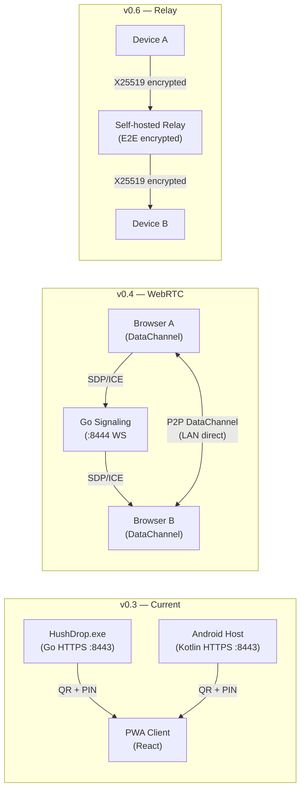

# HushDrop — Phone Host v0.3 Roadmap

> Generated: 2026-10-03. Commit: c5090c7

---

## Completed (v0.1–v0.3)

| Version | Feature |
|---------|---------|
| v0.1 | Go core: TLS1.3 ECDSA, PIN 6-digit TTL10m, chunks 4MB, portable `./data` |
| v0.2 | React PWA frontend, Capacitor Android sideload, Tauri desktop wrapper |
| v0.3 | **Phone-host**: Android embedded HTTPS server (`android-host` module), 1:1 Go API parity, `HostPage.tsx` with QR/PIN/fingerprint, 4-tab navigation |

---

## v0.4 — WebRTC DataChannel + iOS PWA (Q4 2026)

**Goal:** Direct browser-to-browser file transfer without server intermediary, and iOS 17+ support as a client.

### Tasks
- [ ] `internal/signaling/` — lightweight WebSocket signaling relay (Go) for SDP/ICE exchange only (no data in relay)
- [ ] `frontend/src/pages/PeerPage.tsx` — WebRTC DataChannel UI: offer/answer flow, progress bar, cancel
- [ ] iOS PWA manifest tweaks: `apple-touch-icon`, `apple-mobile-web-app-capable`, splash screens
- [ ] `frontend/src/api/peer.ts` — WebRTC abstraction (`createOffer`, `createAnswer`, `sendFile`, `receiveFile`)
- [ ] Chunk size negotiation (DataChannel buffer pressure → adaptive chunk size 64KB-1MB)
- [ ] Fallback: if WebRTC unavailable, offer existing HTTPS transfer

### Security
- All SDP/ICE data passes only over the LAN signaling relay (no STUN/TURN servers — LAN-only)
- Fingerprint of local peer cert shown and verified in pairing modal before DataChannel opens

---

## v0.5 — mDNS Auto-Discovery + AES-GCM At-Rest Encryption (Q1 2027)

**Goal:** Zero-config peer discovery (no QR scan needed on same LAN), and optional encrypted storage for hosted files.

### Tasks
- [ ] `internal/discovery/mdns_advertise.go` — advertise `_hushdrop._tcp.` with fingerprint TXT record (currently only client-side NSD browse)
- [ ] `frontend/src/api/discovery.ts` — mDNS browse via Capacitor `@capacitor-community/mdns` or custom plugin; auto-populate server URL
- [ ] `mobile/android-host/NsdHelper.kt` — already done (browse side to add)
- [ ] **At-rest encryption**: optional AES-256-GCM wrapping of files in `./data/downloads/` using a user-chosen passphrase (derived key via Argon2id)
  - Go: `internal/crypto/atrest.go` — encrypt/decrypt stream
  - Frontend: passphrase entry modal on download (decrypts in browser via WebCrypto)
- [ ] `internal/config/config.go` — add `--encrypt-storage` flag

### Security note
- Passphrase never leaves device; derivation done client-side for PWA downloads
- At-rest encryption is opt-in, disabled by default

---

## v0.6 — Relay Mode + Background Transfer Queue (Q2 2027)

**Goal:** Transfer files even when devices are on different subnets (VPN, mobile data fallback), with a resumable background queue.

### Tasks
- [ ] **Self-hosted relay**: optional Go relay server (`cmd/hushdrop-relay/`) — encrypted end-to-end (X25519+AES-GCM), relay never sees plaintext
  - Relay is self-hosted only; no public HushDrop relay
  - Client authenticates to relay via same PIN+fingerprint flow
- [ ] **Background transfer queue** (Android):
  - `WorkManager`-based `TransferWorker.kt` for large files that survive app backgrounding
  - Queue state persisted to `data/hushdrop_host/queue.json` (file IDs only, no file content)
  - Frontend: `QueuePage.tsx` — queued transfers, retry, cancel
- [ ] **Resume support** (chunked uploads already have chunk tracker; add HTTP `Content-Range` on upload resumption)
- [ ] **Desktop notification** (Tauri) on transfer complete with file name + size

### Security note
- Relay mode requires explicit user opt-in with relay URL configured in `.env`
- All relay traffic is end-to-end encrypted before leaving LAN

---

## Architecture Diagram

